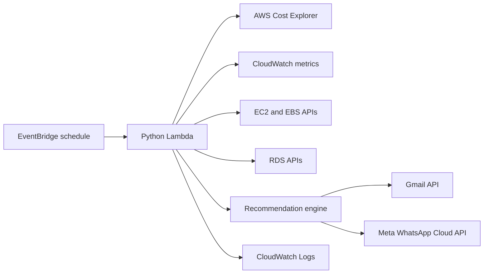

# Cloud Cost Guardrail Bot

A senior-engineer style portfolio project that monitors AWS billing and usage signals, detects cost risks, and sends actionable alerts through Gmail and WhatsApp.

The bot is designed for practical guardrails, not just dashboards. Every finding includes the reason it triggered, priority, estimated savings when available, and the next action to take.

## What It Detects

- Idle EC2 instances using CloudWatch CPU metrics.
- Unattached EBS volumes that still incur storage cost.
- Idle RDS instances using CPU and connection metrics.
- Daily AWS spend spikes using Cost Explorer baselines.
- High-cost services that deserve deeper savings review.

## Architecture



## Repository Layout

```text
infra/                  Terraform infrastructure
src/app.py              Lambda handler and orchestration
src/detectors/          Idle resource, spend spike, and savings detectors
src/notifiers/          Gmail and WhatsApp delivery adapters
src/recommendations.py  Actionable recommendation engine
tests/                  Unit tests with mocked AWS responses
```

## Alert Example

```text
[WARNING] Unattached EBS volume: vol-123
Resource: ebs-volume / vol-123 (ap-south-1)
Why: Volume vol-123 is unattached and has been available for about 10 days.
Action: Snapshot the volume if data must be retained, then delete the unattached volume.
Rationale: Detached EBS volumes keep charging while unused. Estimated savings: $8.00/month.
Next steps:
- Create a final snapshot: aws ec2 create-snapshot --volume-id vol-123
- Delete after validation: aws ec2 delete-volume --volume-id vol-123
- Check whether backups or AMIs already retain this data before deleting.
```

## Local Setup

```bash
python3 -m venv .venv
source .venv/bin/activate
pip install -r requirements-dev.txt
pytest
```

The tests use fake AWS responses for detector and recommendation logic. Real AWS credentials are not required for unit tests.

## Local FastAPI Testing

The deployed app is still an EventBridge-triggered Lambda, but you can run a local FastAPI wrapper for manual testing:

```bash
source .venv/bin/activate
pip install -r requirements-dev.txt
PYTHONPATH=src uvicorn api:api --reload
```

Then test it:

```bash
curl http://127.0.0.1:8000/health
curl -X POST http://127.0.0.1:8000/run \
  -H 'Content-Type: application/json' \
  -d '{"send_alerts": true, "alert_channels": ["gmail"], "gmail_recipient": "you@example.com"}'
```

For local runs, the app automatically reads `gmail_token.json` from the project root if `GMAIL_TOKEN_JSON` is not exported. Terraform `tfvars` values configure the deployed Lambda only; they are not automatically loaded into your local shell.

If `/run` returns an `errors` entry like `User not enabled for cost explorer access`, enable AWS Cost Explorer in the billing console for the payer account and make sure the caller has `ce:GetCostAndUsage`. The bot will still return partial findings from detectors that can run.

## Gmail API Setup

1. Create an OAuth client in Google Cloud Console.
2. Enable the Gmail API.
3. Download the OAuth client JSON as `credentials.json` in the project root.
4. Generate an authorized-user token with the `https://www.googleapis.com/auth/gmail.send` scope:

```bash
python scripts/generate_gmail_token.py --print-terraform-var
```

5. Store the generated `gmail_token.json` securely and pass its JSON value to Lambda as `GMAIL_TOKEN_JSON` for a demo deployment.

For production, move this secret to AWS Secrets Manager and load it at runtime instead of storing it in Terraform state.

## WhatsApp Cloud API Setup

1. Create or use a Meta developer app with WhatsApp enabled.
2. Configure a phone number and recipient test number.
3. Pass these values during Terraform deployment:
   - `whatsapp_access_token`
   - `whatsapp_phone_number_id`
   - `whatsapp_to`

## Deploy With Terraform

```bash
cd infra
terraform init
terraform fmt
terraform validate
terraform apply \
  -var='aws_region=ap-south-1' \
  -var='gmail_recipient=you@example.com' \
  -var='gmail_token_json={...}' \
  -var='whatsapp_access_token=EAAG...' \
  -var='whatsapp_phone_number_id=1234567890' \
  -var='whatsapp_to=15551234567'
```

Terraform packages `src/` and Python dependencies into a Lambda zip, creates the scheduled EventBridge rule, and grants read-only AWS cost/resource permissions.

## Important Security Notes

- Do not commit `.env`, OAuth tokens, Terraform state, or `*.tfvars` containing secrets.
- Terraform variables marked sensitive still land in Terraform state. This is acceptable for a portfolio demo, but Secrets Manager is the better production path.
- The Lambda role is read-only for AWS resource and cost inspection. It does not stop, resize, or delete resources automatically.

## Configuration

| Variable | Default | Purpose |
| --- | --- | --- |
| `TARGET_AWS_REGION` | Lambda region or `ap-south-1` locally | Region used for EC2, EBS, RDS, and CloudWatch checks. |
| `LOOKBACK_DAYS` | `7` | Metric and cost lookback period. |
| `IDLE_CPU_THRESHOLD` | `5` | CPU percentage below which EC2/RDS looks idle. |
| `IDLE_DB_CONNECTION_THRESHOLD` | `1` | RDS connection threshold. |
| `SPEND_SPIKE_MULTIPLIER` | `1.5` | Spike multiplier over baseline. |
| `SPEND_SPIKE_MIN_USD` | `25` | Minimum daily spend before spike alerts trigger. |
| `HIGH_COST_SERVICE_THRESHOLD_USD` | `100` | Service spend threshold for savings review. |
| `ALERT_CHANNELS` | `gmail,whatsapp` | Channels to notify. |

## Demo Story

This project demonstrates AWS cost governance, serverless automation, Python service design, Terraform infrastructure, third-party API integration, and actionable FinOps recommendations. It is intentionally built as a guardrail bot: it tells you what changed, why it matters, and the specific action to perform next.
