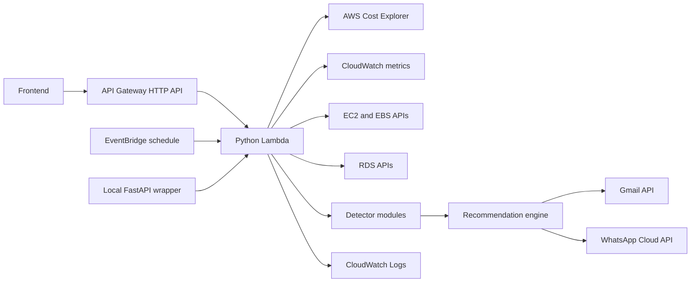
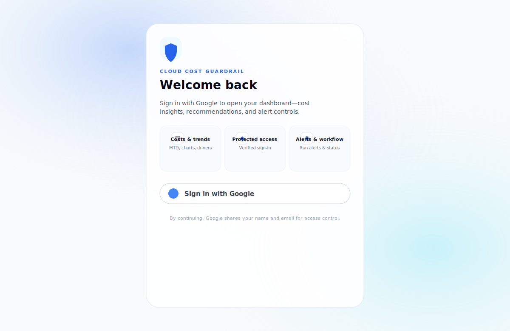

# Cloud Cost Guardrail Bot

Cloud Cost Guardrail Bot is a serverless AWS cost-governance system that detects idle resources, spend spikes, and savings opportunities, exposes a lightweight API for frontend use, and sends actionable recommendations through Gmail and WhatsApp.

The project is built as a production-oriented reference implementation: Terraform-managed infrastructure, a scheduled Python Lambda runtime, local FastAPI testing, focused unit tests, CI validation, and documented operational runbooks.

## Capabilities

- Detect idle EC2 instances from CloudWatch CPU metrics.
- Detect unattached EBS volumes that continue to incur storage cost.
- Detect idle RDS instances from CPU and connection metrics.
- Detect AWS spend spikes using Cost Explorer daily baselines.
- Show current month-to-date AWS cost and top services through `/costs/summary` and recommendation responses.
- Identify high-cost services that need deeper savings review.
- Send human-readable alerts through Gmail API and Meta WhatsApp Cloud API.
- Route Gmail alerts by AWS owner and environment tags.
- Protect the dashboard and API with Google sign-in and an allowed-email list.
- Throttle side-effecting alert runs at API Gateway to reduce repeated notification sends.
- Track recommendation workflow status in DynamoDB: New, Acknowledged, In Progress, Resolved.
- Return partial results when one AWS detector fails, instead of failing the entire run.
- Provide adaptive remediation actions based on service family, spend delta, environment, owner route, and estimated savings.

## System Architecture



See [`docs/architecture.md`](docs/architecture.md) for design details and data flow.

## Repository Layout

```text
.github/workflows/       GitHub Actions CI
deploy.sh                Build static frontend and deploy to S3/CloudFront
infra/                   Terraform infrastructure (root + modules/)
scripts/                 Local helper scripts
src/api.py               Local FastAPI wrapper
src/app.py               Lambda handler and orchestration
src/aws_clients.py       boto3 client factory and AWS wrappers
src/detectors/           Cost and resource detectors
src/notifiers/           Gmail and WhatsApp delivery adapters
src/recommendations.py   Actionable recommendation engine
tests/                   Unit tests with mocked AWS responses
docs/                    Production readiness documentation
frontend/                Next.js cost analyzer dashboard
```

## Documentation

- [`docs/architecture.md`](docs/architecture.md): architecture, runtime flow, and module responsibilities.
- [`docs/deployment.md`](docs/deployment.md): AWS prerequisites, Terraform deployment, and local FastAPI testing.
- [`docs/operations.md`](docs/operations.md): runbooks, troubleshooting, observability, and incident response.
- [`docs/security.md`](docs/security.md): secrets, IAM, Terraform state, and production hardening.
- [`docs/configuration.md`](docs/configuration.md): all runtime and Terraform configuration options.
- [`docs/frontend.md`](docs/frontend.md): Next.js dashboard UX, API integration, state management, and tests.

## Requirements

- Python 3.11 or newer for Lambda compatibility.
- Terraform 1.5 or newer.
- AWS CLI configured with credentials for the target account.
- AWS Cost Explorer enabled in the payer account.
- Gmail API OAuth token for email notifications.
- Meta WhatsApp Cloud API credentials if WhatsApp alerts are enabled.

Default AWS region: `ap-south-1`.

## Quick Start

Install local dependencies:

```bash
python3 -m venv .venv
source .venv/bin/activate
pip install -r requirements-dev.txt
pytest -q
```

Verify AWS credentials:

```bash
aws sts get-caller-identity
```

Run the local FastAPI wrapper:

```bash
PYTHONPATH=src uvicorn api:api --reload
```

Check health:

```bash
curl http://127.0.0.1:8000/health
```

Fetch cost history:

```bash
curl "http://127.0.0.1:8000/costs/summary?months=6"
```

Fetch recommendations without sending alerts:

```bash
curl "http://127.0.0.1:8000/recommendations?months=1"
```

Trigger alerts:

```bash
curl -X POST http://127.0.0.1:8000/alerts/run \
  -H 'Content-Type: application/json' \
  -d '{"cost_months": 6, "alert_channels": ["gmail"], "gmail_recipient": "you@example.com"}'
```

For local runs, the app automatically reads `gmail_token.json` from the project root if `GMAIL_TOKEN_JSON` is not exported.

Cost summary responses include a `cost_summary` block when Cost Explorer data is available. Use `months` on `GET /costs/summary` or `cost_months` on alert runs to request a 1 to 12 month window:

```json
{
  "cost_summary": {
    "months": 6,
    "period": {"start": "2026-04-01", "end": "2026-04-29"},
    "total_unblended_cost": 42.11,
    "month_to_date_unblended_cost": 12.34,
    "currency": "USD",
    "monthly_costs": [
      {"start": "2026-03-01", "end": "2026-04-01", "amount": 29.77, "currency": "USD"},
      {"start": "2026-04-01", "end": "2026-04-29", "amount": 12.34, "currency": "USD"}
    ],
    "top_services": [
      {"service": "Amazon Elastic Compute Cloud - Compute", "amount": 8.12, "currency": "USD"}
    ]
  }
}
```

## Frontend Dashboard

The repo includes a responsive Next.js dashboard in `frontend/` so the project is not only a backend automation bot, but a complete cost analyzer product. It uses TypeScript, Tailwind CSS, Recharts, plain `fetch` with `useEffect`/`useState`, and focused component tests.

The frontend shows:

- Executive cost cards for month-to-date cost, selected window total, open recommendations, and notification readiness.
- Billing due reminder and invoice estimate, including projected month-end charges and an AWS Billing Console link.
- Monthly cost trend and top service driver charts from `/costs/summary`.
- Filterable owner-aware recommendation cards from `/recommendations`, including priority, status, resource, environment, rationale, estimated savings, and next steps.
- Recommendation workflow controls to move items through New, Acknowledged, In Progress, and Resolved.
- Alert workflow controls for `/alerts/run`, including channel selection, an approved Gmail recipient dropdown, delivery status, and notification results.
- Interactive Google login page (animated layout, feature highlights, loading state for the sign-in control) before the dashboard loads, with sign-out and authenticated API calls.
- Loading, empty, error, retry, and partial-data states so Cost Explorer or detector failures do not break the whole page.

The frontend is intentionally simple to understand: no TanStack Query or heavy global state. Data loading is handled through typed API client functions and small custom hooks built with `useEffect`, `useState`, `AbortController`, and retry helpers.

Run it locally against the FastAPI wrapper:

```bash
cd frontend
npm install
cp .env.example .env.local
npm run dev
```

For deployed API Gateway, set `NEXT_PUBLIC_API_BASE_URL` in `frontend/.env.local`:

```bash
NEXT_PUBLIC_API_BASE_URL=https://your-api-id.execute-api.ap-south-1.amazonaws.com
NEXT_PUBLIC_ALLOWED_ALERT_EMAILS=you@example.com,cloud-cost-owner@example.com
NEXT_PUBLIC_GOOGLE_CLIENT_ID=your-google-web-client-id.apps.googleusercontent.com
```

The frontend is configured for static export with `output: "export"` in `frontend/next.config.ts`. Build it for S3/CloudFront with the API Gateway URL embedded as public frontend config:

```bash
cd frontend
NEXT_PUBLIC_API_BASE_URL="https://xyqayo8x14.execute-api.ap-south-1.amazonaws.com" \
NEXT_PUBLIC_ALLOWED_ALERT_EMAILS="you@example.com,cloud-cost-owner@example.com" \
NEXT_PUBLIC_GOOGLE_CLIENT_ID="your-google-web-client-id.apps.googleusercontent.com" \
npm run build
```

Terraform creates a private S3 bucket and CloudFront distribution for the static frontend. The deployable static artifact is written to `frontend/out/`; upload it to the Terraform-managed bucket:

```bash
aws s3 sync out/ "s3://$(terraform -chdir=../infra output -raw frontend_bucket_name)/" --delete
aws cloudfront create-invalidation \
  --distribution-id "$(terraform -chdir=../infra output -raw frontend_cloudfront_distribution_id)" \
  --paths "/*"
terraform -chdir=../infra output -raw frontend_cloudfront_url
```

**One-command deploy** (from the repo root; uses `terraform output` for the bucket and distribution, then syncs and invalidates CloudFront):

```bash
./deploy.sh
```

Set `NEXT_PUBLIC_*` values in `frontend/.env.local` before running. To upload without a CloudFront invalidation, use `SKIP_CLOUDFRONT_INVALIDATION=1 ./deploy.sh`.

The dashboard covers cost summary cards, invoice estimates, billing due reminders, monthly cost charts, top service drivers, owner-aware recommendations, backend health, and the alert delivery workflow.

See [`docs/frontend.md`](docs/frontend.md) for the frontend architecture, UX structure, and test coverage.

## Portfolio Screenshots

Add current screenshots after running the frontend locally or deploying it:




Recommended real captures for a portfolio README:

- Login page: gradient background, feature tiles, and Google sign-in (or local-dev bypass when `NEXT_PUBLIC_GOOGLE_CLIENT_ID` is unset).
- Dashboard overview showing cost cards, invoice estimate, charts, and recommendations.
- Recommendation workflow showing filters and status buttons.
- Alert workflow showing approved Gmail recipients and delivery status.

## Gmail Setup

Create an OAuth client in Google Cloud Console, enable Gmail API, download the client JSON as `credentials.json`, then generate the authorized user token:

```bash
source .venv/bin/activate
python scripts/generate_gmail_token.py --print-terraform-var
```

This writes `gmail_token.json`, which is ignored by git. Treat `credentials.json`, `gmail_token.json`, and Terraform state as secrets.

## Terraform Deployment

Infrastructure is composed from reusable modules under `infra/modules/` (`lambda`, `api_gateway`, `frontend_static`, `schedule`). Root wiring lives in `infra/main.tf`, variables in `infra/variables.tf`, and outputs in `infra/outputs.tf`.

Create `infra/terraform.tfvars` locally. This file is ignored by git.

```hcl
aws_region      = "ap-south-1"
gmail_recipient = "you@example.com"
allowed_alert_recipients = "you@example.com,cloud-cost-owner@example.com"
google_client_id = "your-google-web-client-id.apps.googleusercontent.com"
auth_allowed_emails = "you@example.com,cloud-cost-owner@example.com"
gmail_token_json = <<EOT
{
  "token": "...",
  "refresh_token": "...",
  "token_uri": "https://oauth2.googleapis.com/token",
  "client_id": "...",
  "client_secret": "...",
  "scopes": ["https://www.googleapis.com/auth/gmail.send"]
}
EOT
alert_channels = "gmail"
owner_tag_keys = "OwnerEmail,owner_email,Owner,owner,Team,team"
environment_tag_keys = "Environment,environment,Env,env,Stage,stage"
owner_email_map = <<EOT
{
  "platform": "platform@example.com",
  "prod:payments": "payments-oncall@example.com"
}
EOT
default_owner_email = "cloud-cost-owner@example.com"
default_environment = "dev"
```

Deploy:

```bash
cd infra
terraform init
terraform fmt
terraform validate
terraform apply
```

See [`docs/deployment.md`](docs/deployment.md) for the full production deployment process.

## API Gateway For Frontend

Terraform creates an API Gateway HTTP API in front of the same Lambda used by EventBridge.

After deployment, get the API endpoint:

```bash
cd infra
terraform output api_gateway_endpoint
```

Frontend or manual callers can use:

```bash
curl "$(terraform output -raw api_gateway_endpoint)/health"
open "$(terraform output -raw api_gateway_endpoint)/docs"
curl "$(terraform output -raw api_gateway_endpoint)/costs/summary?months=6"
curl "$(terraform output -raw api_gateway_endpoint)/recommendations?months=1"
curl -X POST "$(terraform output -raw api_gateway_endpoint)/alerts/run" \
  -H 'Content-Type: application/json' \
  -d '{"cost_months": 12, "alert_channels": ["gmail"], "gmail_recipient": "you@example.com"}'
```

Swagger UI is served from `GET /docs`, and the OpenAPI schema is served from `GET /openapi.json`.

Use `GET /costs/summary` for frontend charts, `GET /recommendations` for read-only findings and recommendation lists, and `POST /alerts/run` for notification delivery status. The alert endpoint returns counts and delivery results instead of duplicating the full recommendation payload. `POST /run` remains available only as a compatibility alias.

For a public frontend, add authentication before exposing `/alerts/run` broadly.

If the frontend is hosted on a deployed domain, add it to `frontend_allowed_origins` before running `terraform apply`:

```hcl
frontend_allowed_origins = [
  "http://localhost:3000",
  "https://your-frontend.example.com"
]
```

## Alert Format

Recommendations are context-aware. The engine selects different playbooks for EC2, S3, RDS, EBS, NAT/data transfer, CloudWatch, Lambda, and unknown services. It also changes priority and next steps based on production tags, estimated savings, spend baseline, top service contributors, and owner routing metadata.

```text
[WARNING] Unattached EBS volume: vol-123
Resource: ebs-volume / vol-123 (ap-south-1)
Owner route: platform / platform@example.com
Environment: dev
Why: Volume vol-123 is unattached and has been available for about 10 days.
Action: Snapshot the volume if data must be retained, then delete the unattached volume.
Rationale: Detached EBS volumes keep charging while unused. Estimated savings: $8.00/month.
Next steps:
- Create a final snapshot: aws ec2 create-snapshot --volume-id vol-123
- Delete after validation: aws ec2 delete-volume --volume-id vol-123
- Check whether backups or AMIs already retain this data before deleting.
```

## Testing And CI

Run local checks:

```bash
python -m compileall src tests scripts
pytest -q
terraform -chdir=infra fmt -check -recursive
terraform -chdir=infra validate
```

GitHub Actions runs Python compilation, unit tests, Terraform formatting, and Terraform validation on pushes and pull requests.

## Security Notes

Do not commit real credentials, token files, `.env` files, Terraform state, or `*.tfvars`. The repository `.gitignore` excludes those files by default.

For production, prefer AWS Secrets Manager over Terraform variables for Gmail and WhatsApp secrets. Terraform sensitive variables are still stored in Terraform state.

See [`docs/security.md`](docs/security.md) for production hardening recommendations.

## Production Readiness Status

Implemented:

- Serverless scheduled execution through EventBridge and Lambda.
- API Gateway HTTP API for frontend and manual trigger access.
- Read-only AWS inspection permissions.
- Local FastAPI trigger for manual testing.
- Owner and environment tag routing for Gmail alerts.
- Partial detector failure handling.
- Unit tests and CI.
- Secret-safe git ignore rules.

Recommended before broader production use:

- Move notification secrets to AWS Secrets Manager.
- Add structured JSON logs and CloudWatch alarms for failed runs.
- Store Terraform state in an encrypted remote backend with locking.
- Add integration tests against a sandbox AWS account.
