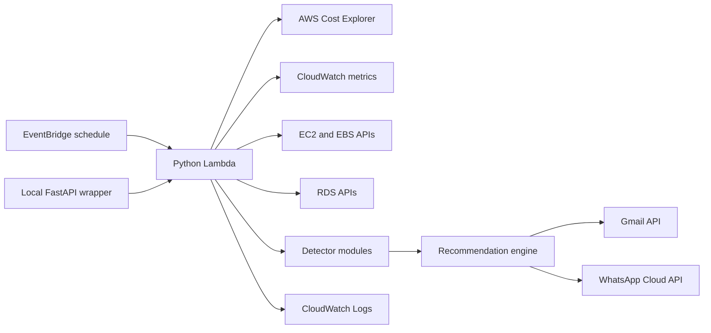

# Cloud Cost Guardrail Bot

Cloud Cost Guardrail Bot is a serverless AWS cost-governance system that detects idle resources, spend spikes, and savings opportunities, then sends actionable recommendations through Gmail and WhatsApp.

The project is built as a production-oriented reference implementation: Terraform-managed infrastructure, a scheduled Python Lambda runtime, local FastAPI testing, focused unit tests, CI validation, and documented operational runbooks.

## Capabilities

- Detect idle EC2 instances from CloudWatch CPU metrics.
- Detect unattached EBS volumes that continue to incur storage cost.
- Detect idle RDS instances from CPU and connection metrics.
- Detect AWS spend spikes using Cost Explorer daily baselines.
- Identify high-cost services that need deeper savings review.
- Send human-readable alerts through Gmail API and Meta WhatsApp Cloud API.
- Route Gmail alerts by AWS owner and environment tags.
- Return partial results when one AWS detector fails, instead of failing the entire run.
- Provide concrete remediation actions, commands, owner checks, and priority levels.

## System Architecture



See [`docs/architecture.md`](docs/architecture.md) for design details and data flow.

## Repository Layout

```text
.github/workflows/       GitHub Actions CI
Dockerfile               FastAPI container image for future ECS deployment
infra/                   Terraform infrastructure
scripts/                 Local helper scripts
src/api.py               Local FastAPI wrapper
src/app.py               Lambda handler and orchestration
src/aws_clients.py       boto3 client factory and AWS wrappers
src/detectors/           Cost and resource detectors
src/notifiers/           Gmail and WhatsApp delivery adapters
src/recommendations.py   Actionable recommendation engine
tests/                   Unit tests with mocked AWS responses
docs/                    Production readiness documentation
```

## Documentation

- [`docs/architecture.md`](docs/architecture.md): architecture, runtime flow, and module responsibilities.
- [`docs/deployment.md`](docs/deployment.md): AWS prerequisites, Terraform deployment, and local FastAPI testing.
- [`docs/operations.md`](docs/operations.md): runbooks, troubleshooting, observability, and incident response.
- [`docs/security.md`](docs/security.md): secrets, IAM, Terraform state, and production hardening.
- [`docs/configuration.md`](docs/configuration.md): all runtime and Terraform configuration options.

## Requirements

- Python 3.11 or newer for Lambda compatibility.
- Terraform 1.5 or newer.
- AWS CLI configured with credentials for the target account.
- AWS Cost Explorer enabled in the payer account.
- Gmail API OAuth token for email notifications.
- Meta WhatsApp Cloud API credentials if WhatsApp alerts are enabled.

Default AWS region: `ap-south-1`.

## Quick Start

Install local dependencies:

```bash
python3 -m venv .venv
source .venv/bin/activate
pip install -r requirements-dev.txt
pytest -q
```

Verify AWS credentials:

```bash
aws sts get-caller-identity
```

Run the local FastAPI wrapper:

```bash
PYTHONPATH=src uvicorn api:api --reload
```

Check health:

```bash
curl http://127.0.0.1:8000/health
```

Trigger a local run with Gmail alerts:

```bash
curl -X POST http://127.0.0.1:8000/run \
  -H 'Content-Type: application/json' \
  -d '{"send_alerts": true, "alert_channels": ["gmail"], "gmail_recipient": "you@example.com"}'
```

For local runs, the app automatically reads `gmail_token.json` from the project root if `GMAIL_TOKEN_JSON` is not exported.

## Gmail Setup

Create an OAuth client in Google Cloud Console, enable Gmail API, download the client JSON as `credentials.json`, then generate the authorized user token:

```bash
source .venv/bin/activate
python scripts/generate_gmail_token.py --print-terraform-var
```

This writes `gmail_token.json`, which is ignored by git. Treat `credentials.json`, `gmail_token.json`, and Terraform state as secrets.

## Terraform Deployment

Create `infra/terraform.tfvars` locally. This file is ignored by git.

```hcl
aws_region      = "ap-south-1"
gmail_recipient = "you@example.com"
gmail_token_json = <<EOT
{
  "token": "...",
  "refresh_token": "...",
  "token_uri": "https://oauth2.googleapis.com/token",
  "client_id": "...",
  "client_secret": "...",
  "scopes": ["https://www.googleapis.com/auth/gmail.send"]
}
EOT
alert_channels = "gmail"
owner_tag_keys = "OwnerEmail,owner_email,Owner,owner,Team,team"
environment_tag_keys = "Environment,environment,Env,env,Stage,stage"
owner_email_map = <<EOT
{
  "platform": "platform@example.com",
  "prod:payments": "payments-oncall@example.com"
}
EOT
default_owner_email = "cloud-cost-owner@example.com"
default_environment = "dev"
```

Deploy:

```bash
cd infra
terraform init
terraform fmt
terraform validate
terraform apply
```

See [`docs/deployment.md`](docs/deployment.md) for the full production deployment process.

## Container Build For ECS

The primary deployment target is still Lambda, but the FastAPI wrapper can be containerized for a future ECS/Fargate deployment.

Build locally:

```bash
docker build -t cloud-cost-guardrail-bot:local .
```

Run locally with AWS credentials mounted from your machine:

```bash
docker run --rm -p 8000:8000 \
  -e TARGET_AWS_REGION=ap-south-1 \
  -e ALERT_CHANNELS=gmail \
  -e GMAIL_RECIPIENT=you@example.com \
  -e GMAIL_TOKEN_JSON='{"token":"..."}' \
  -v "$HOME/.aws:/home/app/.aws:ro" \
  cloud-cost-guardrail-bot:local
```

For ECS, inject secrets through AWS Secrets Manager or SSM Parameter Store and use a task role with the same read-only AWS permissions as the Lambda role.

## Alert Format

```text
[WARNING] Unattached EBS volume: vol-123
Resource: ebs-volume / vol-123 (ap-south-1)
Owner route: platform / platform@example.com
Environment: dev
Why: Volume vol-123 is unattached and has been available for about 10 days.
Action: Snapshot the volume if data must be retained, then delete the unattached volume.
Rationale: Detached EBS volumes keep charging while unused. Estimated savings: $8.00/month.
Next steps:
- Create a final snapshot: aws ec2 create-snapshot --volume-id vol-123
- Delete after validation: aws ec2 delete-volume --volume-id vol-123
- Check whether backups or AMIs already retain this data before deleting.
```

## Testing And CI

Run local checks:

```bash
python -m compileall src tests scripts
pytest -q
terraform -chdir=infra fmt -check -recursive
terraform -chdir=infra validate
```

GitHub Actions runs Python compilation, unit tests, Terraform formatting, and Terraform validation on pushes and pull requests.

## Security Notes

Do not commit real credentials, token files, `.env` files, Terraform state, or `*.tfvars`. The repository `.gitignore` excludes those files by default.

For production, prefer AWS Secrets Manager over Terraform variables for Gmail and WhatsApp secrets. Terraform sensitive variables are still stored in Terraform state.

See [`docs/security.md`](docs/security.md) for production hardening recommendations.

## Production Readiness Status

Implemented:

- Serverless scheduled execution through EventBridge and Lambda.
- Container image path for future ECS/Fargate deployment.
- Read-only AWS inspection permissions.
- Local FastAPI trigger for manual testing.
- Owner and environment tag routing for Gmail alerts.
- Partial detector failure handling.
- Unit tests and CI.
- Secret-safe git ignore rules.

Recommended before broader production use:

- Move notification secrets to AWS Secrets Manager.
- Add structured JSON logs and CloudWatch alarms for failed runs.
- Store Terraform state in an encrypted remote backend with locking.
- Add integration tests against a sandbox AWS account.
