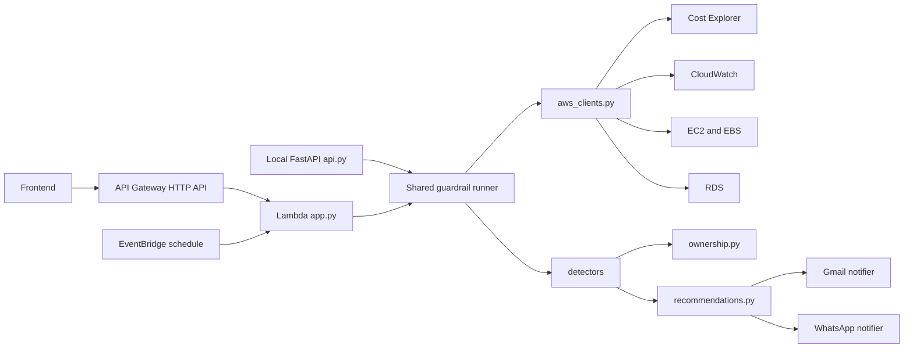

# Architecture

Cloud Cost Guardrail Bot is a scheduled serverless workload. It reads AWS billing and utilization signals, converts raw findings into prioritized recommendations, and sends alerts to humans through notification channels.

## Components

## Runtime Flow

1. EventBridge invokes the Lambda on a schedule, API Gateway invokes it for frontend requests, or a developer calls the local FastAPI endpoints.
2. `config.py` loads thresholds, target region, notification channels, and tokens from environment variables or local token files.
3. `aws_clients.py` creates boto3 clients and wraps paginated AWS API calls.
4. The runner fetches current month-to-date Cost Explorer totals for the `cost_summary` response block.
5. Detector modules inspect idle resources, spend spikes, and high-cost services.
6. `ownership.py` enriches resource findings with owner, owner email, and environment metadata from tags.
7. `app.py` catches detector-level failures and returns partial results with an `errors` array.
8. `recommendations.py` maps findings to priority, rationale, action, and next steps using adaptive service playbooks and finding metadata.
9. Gmail alerts are grouped by resolved owner email; WhatsApp receives the combined alert stream.

## Recommendation Intelligence

The recommendation engine is deterministic but context-aware. It is not a single static message per finding type. It uses:

- Service family detection for EC2, S3, RDS, EBS, NAT/data transfer, CloudWatch, Lambda, and unknown services.
- Spend magnitude, threshold ratio, daily baseline, and spike increase.
- Top Cost Explorer service contributors for spend spikes.
- Environment tags to avoid risky production stop/delete guidance.
- Owner and owner email metadata to route validation steps.
- Estimated monthly savings to raise priority for high-impact actions.

## API Gateway Routes

The production HTTP API exposes:

- `GET /health`: returns target region, configured channels, and notification setup status.
- `GET /costs/summary`: returns month-to-date or historical Cost Explorer totals and top services for frontend charts.
- `GET /recommendations`: runs analysis and returns finding and recommendation lists without sending notifications.
- `POST /alerts/run`: runs analysis and sends configured Gmail or WhatsApp notifications, then returns delivery status and summary counts.
- `POST /run`: deprecated compatibility alias for older clients.

The responses include `cost_summary` for current month-to-date or historical cost visibility, even when no alert thresholds are crossed. Use `months` or `cost_months` to request a 1 to 12 month view.

The API Gateway integration uses Lambda proxy payload format `2.0`. The same Lambda handler supports EventBridge and HTTP API events.

## Failure Model

Detector failures are isolated. For example, if Cost Explorer has no data yet, EC2/EBS/RDS checks can still return findings.

The Lambda role is intentionally read-only. The bot recommends actions but does not stop, resize, or delete resources.

## Boundaries

In scope:

- Scheduled cost governance checks.
- Human-readable alerts.
- Local API testing.
- Terraform-managed AWS infrastructure.
- Owner and environment tag routing for Gmail alerts.
- API Gateway access for a frontend.

Out of scope for the current version:

- Automatic remediation.
- Multi-account AWS Organizations aggregation.
- Historical persistence outside CloudWatch Logs.
- Dashboard UI.
