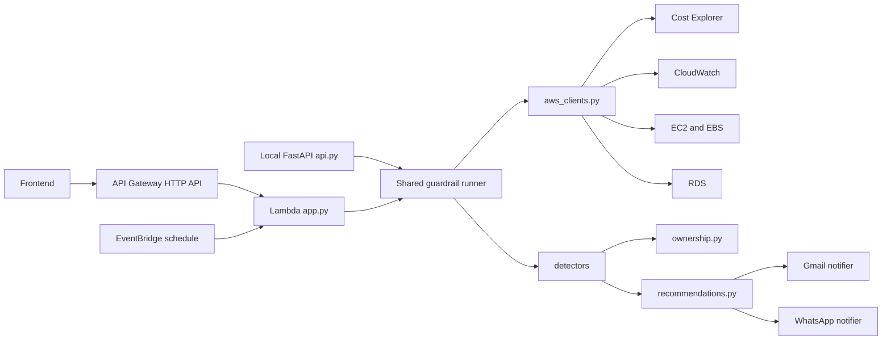

# Architecture

Cloud Cost Guardrail Bot is a scheduled serverless workload. It reads AWS billing and utilization signals, converts raw findings into prioritized recommendations, and sends alerts to humans through notification channels.

## Components

## Runtime Flow

1. EventBridge invokes the Lambda on a schedule, API Gateway invokes it for frontend requests, or a developer calls the local FastAPI `/run` endpoint.
2. `config.py` loads thresholds, target region, notification channels, and tokens from environment variables or local token files.
3. `aws_clients.py` creates boto3 clients and wraps paginated AWS API calls.
4. Detector modules inspect idle resources, spend spikes, and high-cost services.
5. `ownership.py` enriches resource findings with owner, owner email, and environment metadata from tags.
6. `app.py` catches detector-level failures and returns partial results with an `errors` array.
7. `recommendations.py` maps findings to priority, rationale, action, and next steps.
8. Gmail alerts are grouped by resolved owner email; WhatsApp receives the combined alert stream.

## API Gateway Routes

The production HTTP API exposes:

- `GET /health`: returns target region, configured channels, and notification setup status.
- `POST /run`: runs guardrail checks and optionally sends notifications.

The API Gateway integration uses Lambda proxy payload format `2.0`. The same Lambda handler supports EventBridge and HTTP API events.

## Failure Model

Detector failures are isolated. For example, if Cost Explorer has no data yet, EC2/EBS/RDS checks can still return findings.

The Lambda role is intentionally read-only. The bot recommends actions but does not stop, resize, or delete resources.

## Boundaries

In scope:

- Scheduled cost governance checks.
- Human-readable alerts.
- Local API testing.
- Terraform-managed AWS infrastructure.
- Owner and environment tag routing for Gmail alerts.
- API Gateway access for a frontend.

Out of scope for the current version:

- Automatic remediation.
- Multi-account AWS Organizations aggregation.
- Historical persistence outside CloudWatch Logs.
- Dashboard UI.
