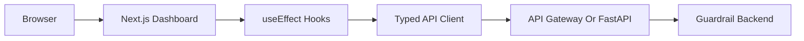

# Frontend Dashboard

The frontend turns the Cloud Cost Guardrail Bot into a complete cost analyzer product. It is built in `frontend/` with Next.js, TypeScript, Tailwind CSS, Recharts, and plain React state management.

## Goals

- Give a reviewer or operator a clear view of AWS cost posture without reading raw JSON.
- Show month-to-date cost, historical trend, and top service drivers.
- Show a billing due reminder and estimated invoice view from Cost Explorer data.
- Explain recommendations in an actionable way: priority, resource, owner, environment, rationale, savings, and next steps.
- Filter recommendations by severity, workflow status, owner, environment, service/category, search text, and minimum estimated savings.
- Track recommendation workflow state: New, Acknowledged, In Progress, Resolved.
- Trigger Gmail or WhatsApp alert delivery from a controlled UI.
- Keep the implementation easy to understand by using `fetch`, `useEffect`, and `useState` instead of a heavier query library.

## User Experience

The dashboard has one responsive page with four main areas:

- Header and controls: backend health, target region, selected analysis window, refresh action, and active API base URL.
- Cost analyzer: month-to-date cost cards, total window cost, monthly trend chart, and top service bar chart.
- Invoice estimate: current estimated charges, projected month-end charges, billing-period reminder, top charge drivers, and AWS Billing Console link.
- Recommendations: prioritized cards with owner/environment context, remediation steps, filtering controls, and status workflow buttons.
- Alert workflow: channel selection, approved Gmail recipient dropdown, alert run button, delivery status, and notification result details.

The UI handles loading, empty, error, retry, and partial-data states. If one detector fails, the page still renders available cost and recommendation data and displays detector errors separately.

The invoice view is an estimate, not an official invoice or payment feature. It uses the current-month Cost Explorer result to project month-end cost and reminds the user before the billing period closes. Payments still happen through AWS Billing Console and the configured AWS payment method.

Recommendation status is persisted in DynamoDB through the backend API, so acknowledged or resolved items are shared across browsers and sessions. The frontend uses optimistic updates and rolls back the UI if the backend rejects a status change.

## Data Flow



## Backend Endpoints

The frontend calls:

- `GET /health`: backend status, region, and notification readiness.
- `GET /costs/summary?months=N`: monthly cost totals and top services.
- `GET /recommendations?months=N`: read-only findings and recommendation details.
- `PATCH /recommendations/status`: updates workflow state for a recommendation.
- `POST /alerts/run`: sends configured alert channels and returns delivery status.

Set the backend URL in `frontend/.env.local`:

```bash
NEXT_PUBLIC_API_BASE_URL=http://127.0.0.1:8000
NEXT_PUBLIC_ALLOWED_ALERT_EMAILS=you@example.com,cloud-cost-owner@example.com
NEXT_PUBLIC_GOOGLE_CLIENT_ID=your-google-web-client-id.apps.googleusercontent.com
```

For deployed AWS:

```bash
NEXT_PUBLIC_API_BASE_URL=https://your-api-id.execute-api.ap-south-1.amazonaws.com
NEXT_PUBLIC_ALLOWED_ALERT_EMAILS=you@example.com,cloud-cost-owner@example.com
NEXT_PUBLIC_GOOGLE_CLIENT_ID=your-google-web-client-id.apps.googleusercontent.com
```

The dashboard does not render the API Gateway URL in the UI. The URL is still present in the compiled JavaScript because browser apps must know where to send requests. Do not rely on hiding the URL for security; protect the API with CORS, recipient allowlists, authentication, throttling, and least-privilege IAM.

## Google Sign-In

The frontend uses Google Identity Services to obtain a Google ID token from a browser sign-in. The API client sends that token as:

```http
Authorization: Bearer <google-id-token>
```

The Lambda/FastAPI backend verifies the token against `GOOGLE_CLIENT_ID` and checks the email against `AUTH_ALLOWED_EMAILS`. This sign-in flow is separate from the Gmail API OAuth token used for sending alert emails.

If `NEXT_PUBLIC_GOOGLE_CLIENT_ID` is empty, the UI shows a local development entry button. That mode is only for local/demo usage; production should set both frontend and backend Google client ID values.

## Static Export

The frontend is configured for static hosting through `output: "export"` in `frontend/next.config.ts`. This means the Next.js build produces static HTML, CSS, and JavaScript that can be hosted from S3 and served through CloudFront. There is no Node.js server or ECS service required for the current frontend.

Build the static frontend with the deployed API Gateway endpoint:

```bash
cd frontend
NEXT_PUBLIC_API_BASE_URL="https://xyqayo8x14.execute-api.ap-south-1.amazonaws.com" \
NEXT_PUBLIC_ALLOWED_ALERT_EMAILS="you@example.com,cloud-cost-owner@example.com" \
NEXT_PUBLIC_GOOGLE_CLIENT_ID="your-google-web-client-id.apps.googleusercontent.com" \
npm run build
```

The generated static files are written to:

```text
frontend/out/
```

Deploy `frontend/out/` to S3:

```bash
aws s3 sync out/ s3://your-frontend-bucket --delete
```

After Terraform apply, use `terraform output frontend_bucket_name` (from `infra/`) for the bucket name. From the repo root you can also run [`deploy.sh`](../deploy.sh), which builds, syncs to that bucket, and optionally invalidates CloudFront (see [deployment.md](deployment.md)).

For production, place CloudFront in front of the S3 bucket and add the CloudFront domain to `frontend_allowed_origins` so browser calls to API Gateway pass CORS.

## Recipient Allowlist

The frontend only allows selecting emails from `NEXT_PUBLIC_ALLOWED_ALERT_EMAILS`, but that is a UX control, not a security boundary. The backend also validates `gmail_recipient` against `ALLOWED_ALERT_RECIPIENTS` and rejects disallowed overrides with `400`.

Keep these lists aligned:

```bash
NEXT_PUBLIC_ALLOWED_ALERT_EMAILS=you@example.com,cloud-cost-owner@example.com
```

```hcl
allowed_alert_recipients = "you@example.com,cloud-cost-owner@example.com"
```

## State Management

The frontend intentionally avoids a global state library. State is local and explicit:

- `src/lib/api.ts`: typed API functions and retry behavior.
- `src/hooks/useApiResource.ts`: reusable `useEffect`/`useState` loading, error, retry, and abort handling.
- `src/hooks/useGuardrailApi.ts`: domain hooks for health, costs, and recommendations.
- `src/components/RecommendationsList.tsx`: local filter state and optimistic recommendation status updates.
- `src/components/AlertRunner.tsx`: local form and submission state for alert runs.

This keeps the code approachable for a portfolio project while still covering real production concerns like cancellation, retries, error display, and partial results.

## Testing

Frontend tests use Vitest and React Testing Library:

- API client success and failure behavior.
- Dashboard loading and rendered data states.
- Recommendation card rendering.
- Recommendation filtering and status updates.
- Alert workflow success and failure rendering.

Run checks:

```bash
cd frontend
npm run lint
npm run typecheck
npm test
npm run build
```

## CORS

API Gateway CORS is controlled by the Terraform variable `frontend_allowed_origins`. Local development allows `http://localhost:3000` and `http://127.0.0.1:3000` by default. Add deployed frontend domains before exposing the dashboard publicly.
