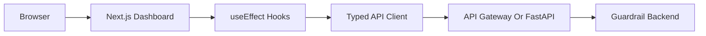

# Frontend Dashboard

The frontend turns the Cloud Cost Guardrail Bot into a complete cost analyzer product. It is built in `frontend/` with Next.js, TypeScript, Tailwind CSS, Recharts, and plain React state management.

## Goals

- Give a reviewer or operator a clear view of AWS cost posture without reading raw JSON.
- Show month-to-date cost, historical trend, and top service drivers.
- Explain recommendations in an actionable way: priority, resource, owner, environment, rationale, savings, and next steps.
- Trigger Gmail or WhatsApp alert delivery from a controlled UI.
- Keep the implementation easy to understand by using `fetch`, `useEffect`, and `useState` instead of a heavier query library.

## User Experience

The dashboard has one responsive page with four main areas:

- Header and controls: backend health, target region, selected analysis window, refresh action, and active API base URL.
- Cost analyzer: month-to-date cost cards, total window cost, monthly trend chart, and top service bar chart.
- Recommendations: prioritized cards with owner/environment context and remediation steps.
- Alert workflow: channel selection, optional Gmail recipient override, alert run button, delivery status, and notification result details.

The UI handles loading, empty, error, retry, and partial-data states. If one detector fails, the page still renders available cost and recommendation data and displays detector errors separately.

## Data Flow



## Backend Endpoints

The frontend calls:

- `GET /health`: backend status, region, and notification readiness.
- `GET /costs/summary?months=N`: monthly cost totals and top services.
- `GET /recommendations?months=N`: read-only findings and recommendation details.
- `POST /alerts/run`: sends configured alert channels and returns delivery status.

Set the backend URL in `frontend/.env.local`:

```bash
NEXT_PUBLIC_API_BASE_URL=http://127.0.0.1:8000
```

For deployed AWS:

```bash
NEXT_PUBLIC_API_BASE_URL=https://your-api-id.execute-api.ap-south-1.amazonaws.com
```

## Static Export

The frontend is configured for static hosting through `output: "export"` in `frontend/next.config.ts`. This means the Next.js build produces static HTML, CSS, and JavaScript that can be hosted from S3 and served through CloudFront. There is no Node.js server or ECS service required for the current frontend.

Build the static frontend with the deployed API Gateway endpoint:

```bash
cd frontend
NEXT_PUBLIC_API_BASE_URL="https://xyqayo8x14.execute-api.ap-south-1.amazonaws.com" npm run build
```

The generated static files are written to:

```text
frontend/out/
```

Deploy `frontend/out/` to S3:

```bash
aws s3 sync out/ s3://your-frontend-bucket --delete
```

For production, place CloudFront in front of the S3 bucket and add the CloudFront domain to `frontend_allowed_origins` so browser calls to API Gateway pass CORS.

## State Management

The frontend intentionally avoids a global state library. State is local and explicit:

- `src/lib/api.ts`: typed API functions and retry behavior.
- `src/hooks/useApiResource.ts`: reusable `useEffect`/`useState` loading, error, retry, and abort handling.
- `src/hooks/useGuardrailApi.ts`: domain hooks for health, costs, and recommendations.
- `src/components/AlertRunner.tsx`: local form and submission state for alert runs.

This keeps the code approachable for a portfolio project while still covering real production concerns like cancellation, retries, error display, and partial results.

## Testing

Frontend tests use Vitest and React Testing Library:

- API client success and failure behavior.
- Dashboard loading and rendered data states.
- Recommendation card rendering.
- Alert workflow success and failure rendering.

Run checks:

```bash
cd frontend
npm run lint
npm run typecheck
npm test
npm run build
```

## CORS

API Gateway CORS is controlled by the Terraform variable `frontend_allowed_origins`. Local development allows `http://localhost:3000` and `http://127.0.0.1:3000` by default. Add deployed frontend domains before exposing the dashboard publicly.
